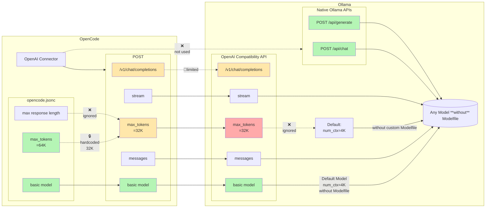
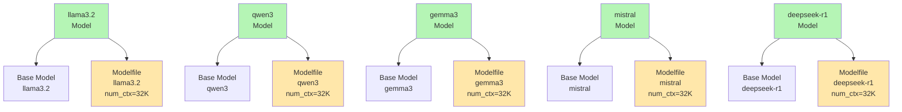
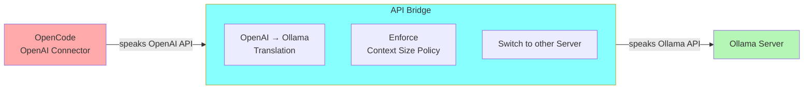
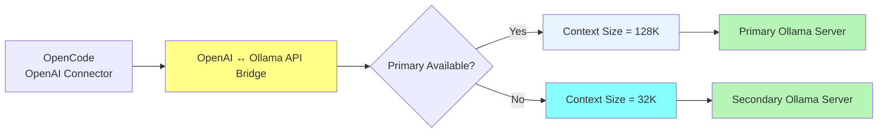
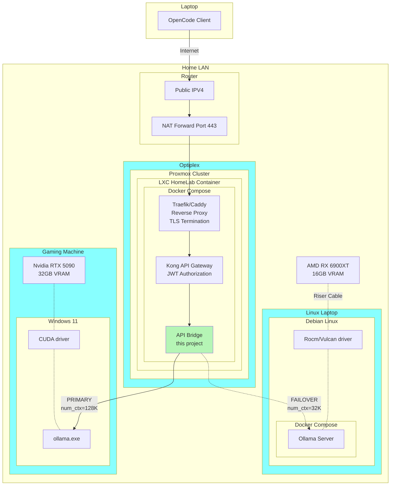

# Architecture & Historical Diagrams

This document contains architecture diagrams and historical context for the py-ollama-openai-bridge project.

## openai-to-ollama bridge
### Problem Diagram (Historical)

This diagram shows the original problem that motivated the bridge: Ollama's OpenAI-compatible endpoint has serious runtime configuration limitations.

### Parameterfile Workaround (without bridge)

This diagram shows why creating custom Modelfiles for every model was problematic.

### translation-mode Default Flow
Central API bridge to enforce runtime settings
Provide a single OpenAI endpoint while centrally enforcing runtime policies and automatically switching to a secondary Ollama server if the primary becomes unavailable.

Provide a single OpenAI endpoint while centrally enforcing runtime policies and automatically switching to a secondary Ollama server if the primary becomes unavailable.

---

### translation-mode High Availability / Failover

Provide a single OpenAI endpoint while automatically switching to a secondary Ollama server if the primary becomes unavailable.

---

### translation-mode Example Setup (Detailed)

This diagram shows a real-world production setup with multiple Ollama servers and infrastructure components.

## Historical Context

These diagrams represent the original problem space and solution approach when the bridge was first conceived. While the core functionality remains the same, the project has evolved to include additional features like:

- **Queue Mode** - Serializing parallel requests for rate-limited APIs
- **Model Name Injection** - `[key=value]` syntax in model names
- **Auto-Pull** - Automatic model downloading on 404 errors
- **Enhanced Failover** - More sophisticated server switching logic

The current architecture is optimized for these newer features, which are now the primary value proposition of the bridge.

## See Also

- [README.md](README.md) - Current project documentation
- [CHANGELOG.md](CHANGELOG.md) - Project evolution history
- [doc/features/](doc/features/) - Detailed feature documentation
