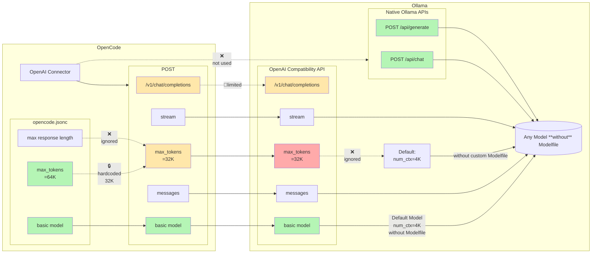
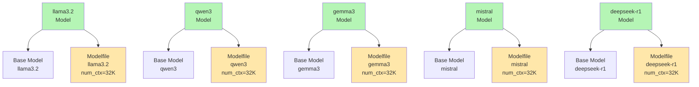
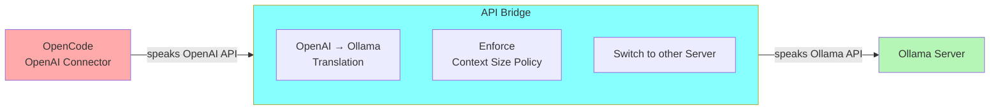
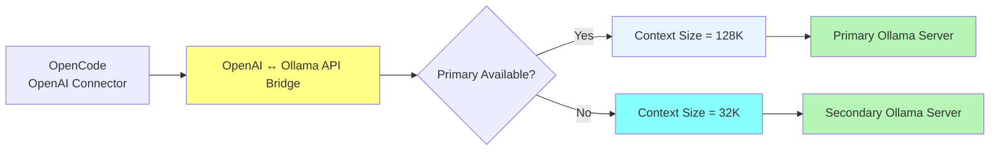

# py-ollama-openai-bridge

A lightweight HTTP proxy that translates OpenAI `/v1/chat/completions` requests to Ollama's native `/api/chat` API and back.

## The Problem

Ollama's OpenAI-compatible endpoint (`/v1/chat/completions`) has serious runtime configuration limitations.

Without custom Modelfiles, parameters such as context size cannot be centrally controlled. Requests through the OpenAI compatibility layer may run with Ollama defaults instead of the desired runtime settings.

The typical workaround is creating **custom Modelfiles** for every single model with settings like:

```
PARAMETER num_ctx 64000
```

This creates duplicated model definitions:

- `llama3.2` → base model + custom Modelfile
- `qwen3` → base model + custom Modelfile
- `gemma3` → base model + custom Modelfile
- `mistral` → base model + custom Modelfile
- `deepseek-r1` → base model + custom Modelfile

20 models = 20 additional Modelfiles.

Changing the context size later means rebuilding or updating all of them again.

The problem is not the models themselves — it is the missing central runtime configuration layer.

### Without creating Ollama Modelfiles, the default OpenCode + Ollama setup has serious compatibility limitations



---

## Why create another custom Modelfile for every model?

The only practical workaround without a bridge is creating a custom Ollama Modelfile for every model just to override runtime parameters.

This is redundant, time-consuming, and difficult to maintain when frequently testing or switching models.


## What this proxy does

Uses Ollama's native `/api/chat` endpoint directly, where runtime parameters are explicitly supported.

One `.env` file configures all models centrally.

| Problem | Without bridge | With bridge |
|---|---|---|
| Context stuck at default | Custom Modelfile per model | `NUM_CTX=64000` in `.env` |
| Output token limits | Client-side limitations | `NUM_PREDICT=128000` override |
| Runtime tuning | Modelfile per model | Central `.env` configuration |
| Tool calls | OpenAI adapter translation issues | Native Ollama format translation |
| Thinking/reasoning fields | Adapter dependent | Passed through transparently |

---

## Central API bridge to enforce runtime settings

Provide a single OpenAI endpoint while centrally enforcing runtime policies and automatically switching to a secondary Ollama server if the primary becomes unavailable.



---

## High Availability / Failover

Provide a single OpenAI endpoint while automatically switching to a secondary Ollama server if the primary becomes unavailable.



---

## Quick Start

### Docker (recommended)

```bash
git clone <repo>
cd py-ollama-openai-bridge
cp .env.example .env

# edit .env: set OLLAMA_URL to your Ollama host

docker compose up -d
```

Bridge available at:

```text
http://localhost:8080/v1
```

---

### Direct (without Docker)

```bash
pip install -r requirements.txt

# configure .env

python proxy.py
```

---

Point OpenCode at the bridge:

```json
{
  "provider": {
    "ollama-bridge": {
      "name": "Ollama (bridged)",
      "npm": "@ai-sdk/openai-compatible",
      "options": {
        "baseURL": "http://localhost:8080/v1"
      },
      "models": {
        "gpt-oss:20b": {
          "name": "_gpt-oss:20b",
          "tool_call": true,
          "limit": {
            "context": 64000,
            "output": 40960
          }
        }
      }
    }
  }
}
```

---

## All options

```env
NUM_CTX=64000
NUM_PREDICT=128000

TEMPERATURE=0.7
TOP_P=0.9
TOP_K=40
MIN_P=0.05
REPEAT_PENALTY=1.1

SEED=42
KEEP_ALIVE=30m
```

Only uncommented values in `.env` are injected.

Unset values use Ollama defaults.

---

## Failover Routing

Two Ollama instances:

```
OLLAMA_URL → FAILOVER_OLLAMA_URL
```

Example:

```env
OLLAMA_URL=http://192.168.0.42:11434

FAILOVER_OLLAMA_URL=http://192.168.0.101:11434

FAILOVER_NUM_CTX=96000
FAILOVER_NUM_PREDICT=128000
FAILOVER_KEEP_ALIVE=5m
```

Features:

- Health check via `GET /api/tags`
- Automatic switch when primary is unavailable
- Failover on connection errors and timeouts
- Independent failover parameters
- Simple mode: only `OLLAMA_URL` required

---

## API Comparison

| Feature | OpenCode w/ Ollama | API Bridge |
|---|---|---|
| OpenAI Chat Completions | ✅ | ✅ |
| OpenAI Responses API | ⚠️ Limited | ✅ |
| Native `/api/chat` | ❌ | ✅ |
| Native `/api/generate` | ❌ | ✅ |
| Streaming | ✅ | ✅ |
| Tool Calling | Backend dependent | Preserved |
| Multiple Ollama Servers | ❌ Manual switch | ✅ |
| Context Size Policy | ❌ Per-model Modelfiles | ✅ Centralized runtime policy |
| Automatic Failover | ❌ | ✅ |
| Routing Policies | ❌ | ✅ |
| Single Stable Endpoint | ❌ | ✅ |

---

## Runtime configuration model

Instead of creating model-specific Modelfiles:

```
llama3.2 + Modelfile
qwen3    + Modelfile
gemma3   + Modelfile
mistral  + Modelfile
deepseek + Modelfile
```

the bridge applies runtime policies centrally:

```
.env
 |
 +-- NUM_CTX
 +-- NUM_PREDICT
 +-- TEMPERATURE
 +-- TOP_P
 +-- TOP_K
 +-- KEEP_ALIVE
 |
 v
All Ollama models
```

This allows changing runtime behaviour without rebuilding model definitions.

---

## Design goals

- Keep OpenAI-compatible clients unchanged
- Use Ollama's native API capabilities
- Avoid duplicated Modelfiles
- Centralize runtime configuration
- Support multiple Ollama backends
- Provide automatic failover
- Preserve streaming responses
- Preserve tool calls and reasoning metadata where available

---

## License

MIT