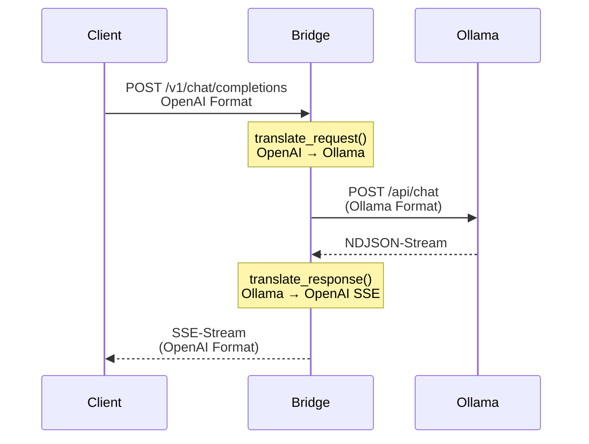
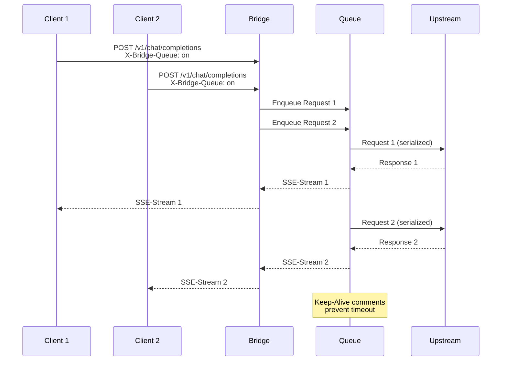
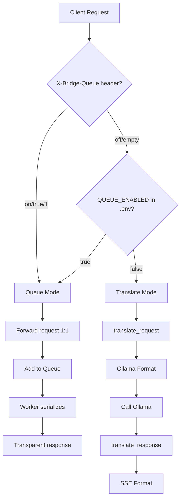
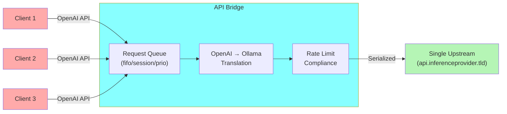
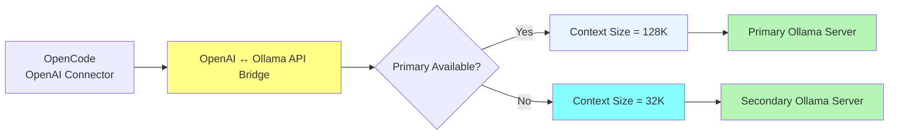

# py-ollama-openai-bridge


Intelligent Ollama proxy with queue mode, model name parameter injection, and automatic failover for OpenAI-compatible clients.

## Table of Contents

- [Why This Bridge?](#why-this-bridge)
- [Quick Start](#quick-start)
- [Two Operating Modes](#two-operating-modes)
- [Features](#features)
- [Configuration](#configuration)
- [Architecture](#architecture)
- [Non-Goals](#non-goals)
- [Further Documentation](#further-documentation)
- [License](#license)

## Why This Bridge?

Ollama's OpenAI-compatible endpoint (`/v1/chat/completions`) lacks central runtime configuration. Without custom Modelfiles, parameters like context size cannot be controlled centrally. This bridge solves that problem while adding enterprise features:

- **Queue Mode** - Serialize parallel requests for rate-limited APIs (e.g., cheapestinference.com)
- **Model Name Injection** - `[key=value]` syntax in model names for client-compatible parameters
- **Auto-Pull** - Automatically download models on 404 errors
- **Failover** - Automatic switching between primary/backup Ollama servers
- **Central Configuration** - One `.env` file configures all models

## Quick Start

### Docker (recommended)

```bash
git clone <repo>
cd py-ollama-openai-bridge
cp .env.example .env

# edit .env: set OLLAMA_URL to your Ollama host

docker compose up -d
```

### Using GHCR Image (without building locally)

```bash
# Pull the latest image from GHCR
docker pull ghcr.io/yasuoiwakura/openai-ollama-api-bridge:latest

# Or run directly with docker compose (pulls from GHCR automatically)
IMAGE_TAG=latest docker compose up -d
```

Bridge available at:

```text
http://localhost:8080/v1
```

### Direct (without Docker)

```bash
pip install -r requirements.txt

# configure .env

python proxy.py
```

Point OpenCode at the bridge:

```json
{
  "provider": {
    "ollama-bridge": {
      "name": "Ollama (bridged)",
      "npm": "@ai-sdk/openai-compatible",
      "options": {
        "baseURL": "http://localhost:8080/v1"
      },
      "models": {
        "gpt-oss:20b": {
          "name": "_gpt-oss:20b",
          "tool_call": true,
          "limit": {
            "context": 64000,
            "output": 40960
          }
        }
      }
    }
  }
}
```

## Two Operating Modes

The bridge operates in two distinct modes, each designed for specific use cases:

| Aspect | Translate Mode | Queue Mode |
|--------|----------------|------------|
| **Purpose** | OpenAI ↔ Ollama translation | Serialization for rate-limited APIs |
| **Data Flow** | Client → Bridge (translate) → Ollama → Bridge (translate) → Client | Multiple Clients → Queue → 1 Worker → External API (pass-through) |
| **Request Handling** | Translated (OpenAI → Ollama) | Pass-through (OpenAI → OpenAI) |
| **Response Handling** | Translated (Ollama NDJSON → OpenAI SSE) | Pass-through (SSE stream) |
| **Upstream** | Local Ollama server | External OpenAI-compatible API |
| **Failover** | ✅ Yes (automatic) | ❌ No (single target) |
| **Keep-alive** | ❌ No (SSE stream) | ✅ Yes (`: keepalive` comments) |
| **Key Features** | Tool-Calls, Reasoning, Auto-Pull | Scheduler Modes, SizeTracker, Rate-Limit |
| **Activation** | Default (no Queue headers) | `X-Bridge-Queue: on` header |

### Translate Mode (Default)



**Features:**
- Request Translation: OpenAI `messages` → Ollama `messages` (incl. Tool-Calls, images)
- Response Translation: Ollama NDJSON → OpenAI SSE Chunks
- Failover: Automatic switch to backup server on ConnectionError
- Auto-Pull: Auto-download missing models (on 404)
- Model Name Parameters: `[key=value;key=value]` in model name
- Server Override: `[server=1]` or `[server=failover]` for explicit routing

### Queue Mode



**Features:**
- Serialization: N parallel requests → 1 upstream request
- Keep-alive: SSE comments (`: keepalive`) during wait time
- Scheduler Modes: FIFO, Session-aware, Priority-based
- Fallback-Timeout: Wait time before 200 OK (default 15s)
- SizeTracker: Learns from 413 errors, blocks too large requests
- RateLimitTracker: Blocks on 429 with Retry-After
- Transparent Errors: Upstream status codes forwarded 1:1

### Mode Selection



## Features

| Feature | Description | Use Case |
|---------|-------------|----------|
| **Queue Mode** | Serialize parallel requests | Rate-limited APIs (cheapestinference.com) |
| **Model Name Injection** | `[key=value]` syntax in model names | Client-compatible parameters without headers |
| **Auto-Pull** | Auto-download models on 404 | User-friendly model management |
| **Failover** | Automatic server switching | High availability during server outages |
| **Central Configuration** | `.env` for all models | No more Modelfiles needed |
| **OpenAI Compatibility** | Native tool calls & streaming | Seamless integration |

## Configuration

### Basic Configuration

```env
NUM_CTX=64000
NUM_PREDICT=128000

TEMPERATURE=0.7
TOP_P=0.9
TOP_K=40
MIN_P=0.05
REPEAT_PENALTY=1.1

SEED=42
KEEP_ALIVE=30m
```

Only uncommented values in `.env` are injected. Unset values use Ollama defaults.

### Kubernetes Deployment (Important)

When deploying to Kubernetes, the `BRIDGE_PORT` environment variable can conflict with Kubernetes system-injected variables. Kubernetes injects `BRIDGE_PORT=tcp://<cluster-ip>:<port>` for Services, which causes a `ValueError` when the application tries to parse it as an integer.

**Solution:** Use `LISTEN_PORT` instead of `BRIDGE_PORT`:

```bash
# Old (conflicts with Kubernetes)
BRIDGE_PORT=8080

# New (Kubernetes-safe)
LISTEN_PORT=8080
```

The application checks `LISTEN_PORT` first, then falls back to `BRIDGE_PORT` for backward compatibility.

### Queue Mode Configuration

When Queue Mode is active (`X-Bridge-Queue: on` or `QUEUE_ENABLED=1`), multiple concurrent requests are serialized to one upstream connection.

| Mode | Description |
|---|---|
| `fifo` | **First In, First Out** - Requests are processed in the order they arrive (default) |
| `session` | **Session-aware** - Prefers requests from the same session (based on `[session-id=...]` parameter) |
| `prio` | **Priority-based** - Requests with lower priority number are processed first (`[Prio=1]` = highest, `[Prio=999]` = lowest, default=100) |

**Queue Headers:**

| Header | Description | Default |
|---|---|---|
| `X-Bridge-Queue` | Enable/disable queue: `on`/`off` | From `.env` `QUEUE_ENABLED` |
| `X-Bridge-Queue-Mode` | Override queue mode: `fifo`, `session`, `prio` | `QUEUE_MODE_DEFAULT` |
| `X-Bridge-Target-URL` | Override upstream URL | `QUEUE_TARGET_URL` |
| `X-Bridge-Target-Key` | Override upstream API key | `QUEUE_TARGET_KEY` |
| `X-Bridge-Prio` | Override request priority (1-999) | 100 |
| `X-Bridge-Max-Waittime` | Override max wait time in seconds | `QUEUE_MAX_WAITTIME` |
| `X-Bridge-Fallback-Timeout` | Wait time before sending 200 OK to queued request | `QUEUE_FALLBACK_TIMEOUT` |
| `X-Bridge-Size-Tracker` | Enable/disable 413 learning: `on`/`off` | `BRIDGE_SIZE_TRACKER` |
| `X-Bridge-Translate` | Enable/disable translation: `on`/`off` | always on |

**Queue Configuration:**

```env
# Pause between upstream requests (prevents 429 with 1-connection limit)
UPSTREAM_PAUSE=1.5

# Threshold for SLOW detection (TPS); currently only acts as logging threshold
UPSTREAM_LOW_TPS=1.0

# Queue timeouts / limits
QUEUE_KEEPALIVE=15
QUEUE_CONNECT_TIMEOUT=60
QUEUE_STREAM_TIMEOUT=600
QUEUE_MAX_SIZE=500
QUEUE_FALLBACK_TIMEOUT=15
```

### Model Name Parameter Injection

Parameters can be embedded directly in the model name using `[key=value]` syntax. This allows per-request overrides without changing headers or `.env`.

**Syntax:** `model_name[key1=value1;key2=value2]`

**Supported Parameters:**

| Parameter | Example | Effect |
|---|---|---|
| `num_ctx` | `[num_ctx=64000]` | Override context window size |
| `temperature` | `[temperature=0.7]` | Override sampling temperature |
| `Prio` | `[Prio=1]` | Queue priority (1=highest, 999=lowest, default=100) |
| `session-id` | `[session-id=abc123]` | Session tracking for queue mode |
| `pull` | `[pull=true]` | Auto-pull model if not found (404) |
| `server` | `[server=failover]` | Force routing to specific server |
| `translate` | `[translate=off]` | Disable OpenAI→Ollama translation for this request |
| `queue` | `[queue=on]` | Enable/disable queue for this request |
| `override` | `[override=off]` | Disable .env parameter injection for this request |

**Examples:**

```bash
# Force failover server
model=qwen3.5:9b[server=failover]

# Combine with other parameters
model=deepseek-v4[num_ctx=32768;server=ollama;Prio=1]

# Numeric alias
model=qwen3[server=2]
```

**Server Routing (`server` parameter):**

| Value | Alias | Target |
|---|---|---|
| `ollama` | `1` | Primary server (`OLLAMA_URL`) |
| `failover` | `2` | Secondary server (`FAILOVER_OLLAMA_URL`) |

> **Note:** The `server` parameter is ignored in Queue Mode (`X-Bridge-Queue: on`),
> where the target is determined by `X-Bridge-Target-URL` or `.env` settings.

### Failover Configuration

Two Ollama instances:

```
OLLAMA_URL → FAILOVER_OLLAMA_URL
```

Example:

```env
OLLAMA_URL=http://192.168.0.42:11434

FAILOVER_OLLAMA_URL=http://192.168.0.101:11434

FAILOVER_NUM_CTX=96000
FAILOVER_NUM_PREDICT=128000
FAILOVER_KEEP_ALIVE=5m
```

Features:

- Health check via `GET /api/tags`
- Automatic switch when primary is unavailable
- Failover on connection errors and timeouts
- Independent failover parameters
- Simple mode: only `OLLAMA_URL` required

## Architecture

### Core Architecture - Queue Mode



### Failover Architecture



For detailed architecture diagrams and historical context, see [ARCHITECTURE.md](ARCHITECTURE.md).

## Non-Goals

- **Queue Mode does NOT provide failover** (single target only)
- **Queue Mode does NOT translate requests** (OpenAI → OpenAI pass-through)
- **Translate Mode does NOT serialize requests** (one request at a time per client)
- **Translate Mode does NOT support external APIs** (Ollama servers only)

## Design Goals

- Keep OpenAI-compatible clients unchanged
- Use Ollama's native API capabilities
- Avoid duplicated Modelfiles
- Centralize runtime configuration
- Support multiple Ollama backends
- Provide automatic failover
- Preserve streaming responses
- Preserve tool calls and reasoning metadata where available

## Features Implemented

- Queue Mode with fifo/session/prio modes
- Health check caching (60s TTL)
- Auto-pull models on 404
- Per-request parameter overrides via model name syntax
- Rate limit tracking (429 "window opens")
- Size tracker (413 learning)

## Features Planned

- Queue mode: keepalive (single persistent connection)

## Further Documentation

- [ARCHITECTURE.md](ARCHITECTURE.md) - Architecture diagrams and historical context
- [NOTES.md](NOTES.md) - OpenCode integration and pitfalls
- [doc/features/](doc/features/) - Detailed feature documentation
- [CHANGELOG.md](CHANGELOG.md) - Change history
- [IMPLEMENTATION_PLAN.md](IMPLEMENTATION_PLAN.md) - Technical details

## License

MIT
